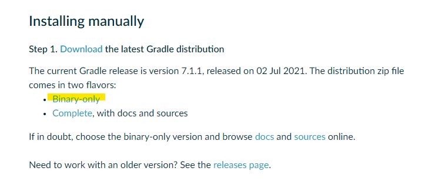
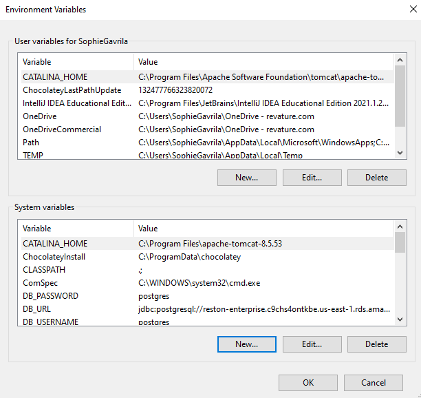
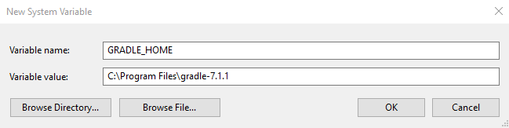
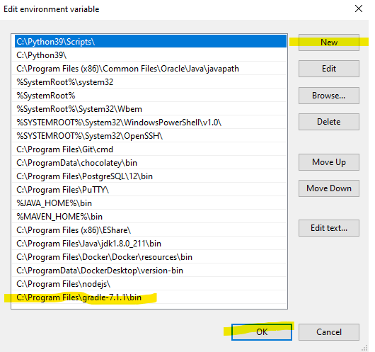
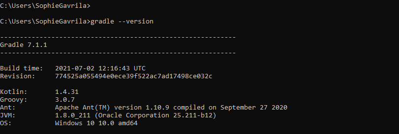

# Install Gradle
> *The following steps guide you through installing gradle on Windows 10.  If you're installing it on Mac please go [here](https://kodejava.org/how-do-i-install-gradle-in-os-x/).*

1. Go to [Gradle's installation page]() and click `Binary-only` under **Installing Manually**.

2. Clicking `Binary-Only` will download a zip file.  Open this file and extract the contents (`gradle-7.1.1-bin`) to `C:\Program Files`.

3. Set environment variables: Press the ⊞ Windows Key and type `environment`.  Click `Edit the system environment variables`.

4. In the `System Properties` box, click `Environment Variables...`.

5. Under `System Properties` (bottom box), click `New...`

6. For `Variable name` type `GRADLE_HOME`.  

7. For `Variable value` click `Browse Directory` and select where your extracted `gradle-7.1.1` file was extracted.  *For example, if you extracted it as directed in step #2, the `Variable value` should be* `C:\Program Files\gradle-7.1.1`. Click `OK`.

8. Back in the `System variables` sections of your Environment Variables, find the **`Path`** variable. Click on this.

9. Edit the `Path` variable by clicking new, and paste the same value for the previously assigned GRADLE_HOME variable, but with `\bin` appended to it, *like so*: `C:\Program Files\gradle-7.1.1\bin`.  Click `OK`, and then `OK` 2 more times to exit and save your environment variables.

10. Verify that Gradle is installed by opening up a CMD prompt and enter the following command: `gradle --version`. It should return the following text confirming that Gradle is indeed installed on your machine.

 

> :exclamation: *If you couldn't figure out these steps please refer to [this video tutorial on how to install Gradle on Windows](https://www.youtube.com/watch?v=h6Figshq6_I)*.

 
